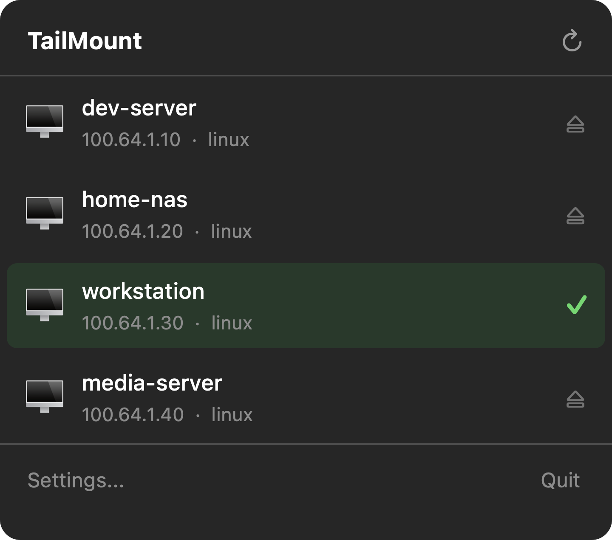

# TailMount

A macOS menu bar app that mounts remote [Tailscale](https://tailscale.com) servers as local volumes via SSH. Click a server, it appears in Finder.

<p align="center">
  
</p>

## How it works

1. Discovers online Tailscale peers with SSH (port 22) reachable
2. Click a server to mount it as a Finder volume at `/Volumes/<server-name>`
3. Browse files natively in Finder — no extra tools needed

Under the hood, TailMount connects via SFTP (using [Citadel](https://github.com/orlandos-nl/Citadel), a pure-Swift SSH library), runs a local WebDAV server, and uses macOS's built-in `mount_webdav` to create a real Finder mount.

**No macFUSE. No sshfs. No brew installs. Just a single .app.**

## Download

Download the latest DMG from the [Releases](../../releases/latest) page.

> The app is ad-hoc signed. On first launch, right-click → Open to bypass Gatekeeper.

## Requirements

- macOS 14.0 (Sonoma) or later
- [Tailscale](https://tailscale.com/download) installed and connected
- SSH enabled on your remote nodes (standard OpenSSH or Tailscale SSH)

## Features

- **Auto-discovery** — finds all SSH-reachable nodes on your tailnet
- **One-click mount** — mounts as a native Finder volume
- **SSH config aware** — reads `~/.ssh/config` for per-host usernames
- **Tailscale SSH support** — uses "none" auth (WireGuard identity)
- **Per-node usernames** — prompts and remembers username on auth failure
- **Menu bar app** — lives in the menu bar, no Dock icon

## Building from source

### Prerequisites

- Xcode 16+
- [XcodeGen](https://github.com/yonaskolb/XcodeGen) (`brew install xcodegen`)

### Build

```bash
git clone https://github.com/h4ux/TailMount.git
cd TailMount
xcodegen generate
xcodebuild -project TailMount.xcodeproj -scheme TailMount -configuration Release build
```

### Create DMG

```bash
./scripts/build-dmg.sh
# Output: build/TailMount-1.0.0.dmg
```

## Architecture

```
TailMount/
├── App/
│   ├── TailMountApp.swift      # MenuBarExtra entry point
│   └── AppState.swift           # Central state management
├── Models/
│   ├── TailscaleNode.swift      # Peer model + JSON parsing
│   └── MountState.swift         # Mount lifecycle enum
├── Services/
│   ├── TailscaleService.swift   # tailscale status --json + SSH probe
│   ├── SFTPBridge.swift         # Citadel SFTP actor
│   ├── WebDAVServer.swift       # Local NIO HTTP → SFTP bridge
│   └── MountService.swift       # Orchestrates connect → serve → mount
└── Views/                       # SwiftUI views
```

**Data flow:** Tailscale CLI → SSH probe → SFTP (Citadel) → WebDAV (SwiftNIO) → mount_webdav → Finder

## License

MIT
